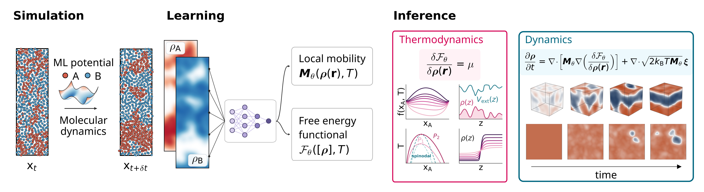

> [!NOTE]
> 🔄 **This code is actively developed.** New features and documentation are added regularly, and the
> command line may still evolve between releases.

<div align="center">

# Ab initio phase-field models

**Phase-field models derived from molecular dynamics, with the free-energy functional and mobility learned from *ab initio* data.**

[](https://arxiv.org/abs/2610.01432)
[](https://mlds-nus.github.io/ab-initio-phase-field-models/)



</div>

AIPF (imported as `aipf`) turns short molecular-dynamics trajectories of ab initio accuracy into a
mesoscopic model of a mixture: a free-energy functional $\mathcal{F}_\theta[\rho, T]$ and a mobility
$M_\theta(\rho, T)$. Together they give the phase diagram, from the free energy alone, and the
fluctuating phase-field dynamics

$$\partial_t \rho = \nabla\cdot\left[M_\theta \nabla \frac{\delta \mathcal{F}_\theta}{\delta \rho}\right] + \nabla\cdot\sqrt{2 k_B T M_\theta}\,\xi$$

at length and time scales the MD cannot reach.

## What it does

- **Learns from the dynamics of MD density fields.** Training matches the time derivative of the
  Fourier modes of coarse-grained MD densities, so thermodynamics and transport come from the same data.
- **A nonlocal free-energy functional.** A neural local free energy plus a learned pair kernel, whose
  $k^2$ coefficient is the gradient-energy (interface) coefficient.
- **A mobility measured from fluctuations.** The Onsager mobility matrix is symmetric positive
  semi-definite by construction and anchored to mobilities measured from equilibrium MD, together
  with the measured structure factor $S_{cc}(0)$ and the equation of state.
- **Noise from the fluctuation-dissipation theorem.** Stochastic rollouts add noise of covariance
  $2 k_B T M$, the same mobility that sets the drift, so the model fluctuates at equilibrium.
- **Phase diagrams and dynamics.** Binodals, spinodals, critical temperatures, the thermodynamic
  factor $\Gamma$, and phase-field simulations compared against MD.
- **One package, any system.** A physical system is one declaration, `experiments/<name>/system.py`.

## Systems

The published model of each system is tracked in the repository, under `data/<system>/ckpt/published/`.

| system | what is learned | states covered | what the published model gives |
|---|---|---|---|
| `hhe`, hydrogen-helium | two density fields, a 2 × 2 mobility, from MD with a machine-learned potential | 200 to 800 GPa, 2000 to 12 000 K | the H/He binodal and spinodal and their critical line, with $T_c$ from about 6300 K at 200 GPa to 9200 K at 800 GPa, for helium rain in Jupiter and Saturn |
| `feb`, iron-boron | two density fields, a 2 × 2 mobility, from MD with a machine-learned potential | 0, 5 and 10 GPa, 1200 to 2600 K | the thermodynamic factor $\Gamma(x_B, T)$ and the spinodal regions of the liquid at each pressure |
| `lj`, binary Lennard-Jones | one composition field, from overdamped Langevin MD (reduced units) | $T$ = 1.10 to 1.70 | the phase diagram and coarsening against MD, with Flory-Huggins and Landau baselines trained on the same data |

## Install

```bash
git clone https://github.com/MLDS-NUS/ab-initio-phase-field-models.git
cd ab-initio-phase-field-models
pip install -e ".[dev]"     # Python 3.12; install the torch build your platform needs first
```

That is enough to load, diagnose and redraw the published models. Running molecular dynamics also
needs the `[md]` extra and a LAMMPS build with ML-IAP:

```bash
pip install -e ".[md]"
bash env/build-lammps.sh --prefix "$CONDA_PREFIX"
```

Or build one conda environment with everything, LAMMPS included:

```bash
bash env/build-env.sh --with-lammps     # AIPF_ENV_PREFIX for a path, else an environment named aipf
```

Pinned versions, the MACE and LAMMPS details and a check of the result (`aipf md doctor`) are in
[docs/guides/environment.md](docs/guides/environment.md). Where a machine keeps its raw MD data and
programs goes in `aipf.toml` (copy `aipf.toml.example`) or in `AIPF_*` variables. The published
models need neither.

## Quick start

```bash
aipf diagnose --system hhe --ckpt published --stage kappa
aipf diagnose --system feb --ckpt published --stage kappa
aipf diagnose --system lj  --ckpt published --stage one_field_phase_diagram
```

Each runs on a CPU in seconds, needs no MD data, and prints the directory it wrote,
`data/<system>/diagnose/<md5[:12]>/`. `--ckpt published` checks the tracked checkpoint against the
md5 its system declares before reading it. The first two write `kappa.json`, the gradient-energy
matrix of the learned kernel. The third writes the binodal, spinodal and critical temperature of
the Lennard-Jones mixture. The other stages (`phase_diagram`, `stability_map`, `dome`, `tc`) read
the equation-of-state tables tracked under `experiments/<system>/eos/`, so they too run without the
raw data root, and are listed in [docs/reference/diagnose.md](docs/reference/diagnose.md).

### Train on the sample

Each system also carries a small training sample, `data/<system>/sample/`, so that training runs
from a clean checkout with no MD data:

```bash
aipf train --system hhe --source sample --anchors declared --resume-optimizer no --seed 0 --epochs 1 --run sample
aipf train --system lj  --source sample --anchors declared --resume-optimizer no --seed 0 --epochs 1 --run sample
aipf train --system feb --source sample --anchors none     --resume-optimizer no --seed 0 --epochs 1 --run sample
```

The H/He and Lennard-Jones runs train every loss term their systems declare, the Fe-B run the
drift term and the kernel hinge (add `--device cpu` to stay off a GPU). Each takes under a minute and writes
`data/<system>/ckpt/sample/final.ckpt`, which `aipf diagnose --ckpt` reads. The sample is there to
exercise the pipeline, not to reproduce the published models: it holds a window or two of a
few runs, so a model trained on it carries no physics. See
[docs/guides/workflow.md](docs/guides/workflow.md#7-training-on-the-bundled-sample).

## Reproduce the paper figures

Every figure drawn with matplotlib lives in `figures/<fig>/`: `figdata/` holds the arrays it shows
and `draw.py` draws it. `figures/reference/` holds the paper's own files.

Run these in the environment `env/build-env.sh` builds. It carries the matplotlib and freetype the
figures were drawn with (`figures/common/BUILD.txt`), PyMuPDF and nbconvert.

```bash
jupyter nbconvert --to notebook --execute --inplace figures/paper_figures.ipynb   # every figure, ~15 min
pytest tests/test_figures.py                        # each draw.py keeps its contract
pytest tests/test_figures.py -m slow                # redraw all, compare with the paper at 200 dpi
pytest tests/test_figdata_from_package.py -m slow   # recompute the figure data from the published models
```

Or open `figures/paper_figures.ipynb` and run all cells: it draws each figure into `figures/out/`
and shows it. [figures/README.md](figures/README.md) maps every paper figure to its directory and data.

## Train on your own MD data

The whole chain, from molecular dynamics to a diagnosed model, is one command per step:

```bash
aipf md run     --system lj --template cube-overdamped --out $AIPF_RAW_LJ/run1   # LAMMPS
aipf data build --system lj                                                     # index the runs
aipf modes      --system lj --tag cube_x0.50_T1.6_s42 --sigma 1.5 --k-cut 3.0   # Fourier modes
aipf train      --system lj --run my-run --seed 0 --epochs 10 --source "cube=.:cube_*:16,16,16" \
                --anchors declared --resume-optimizer no
aipf diagnose   --system lj --ckpt $AIPF_DATA/lj/ckpt/my-run/final.ckpt --stage one_field_phase_diagram
```

[docs/guides/workflow.md](docs/guides/workflow.md) runs it end to end on the Lennard-Jones mixture,
with the output of every command, and then generates iron-boron MD data at full size.
[docs/guides/new-system.md](docs/guides/new-system.md) declares a system of your own.

The raw MD archive the published models were trained on is not part of the repository; it is
available from the authors on request. Training the published systems again needs it.

## Repository layout

```text
src/aipf/          the package: functionals, mobility, training, diagnosis, solvers, MD, data
experiments/       one folder per physical system, each a system.py (hhe, feb, lj)
data/<system>/ckpt/published/   the published checkpoints
data/<system>/sample/           a small training sample (the rest of data/ is local)
figures/           the paper's figures, redrawn from committed data, and the notebook
docs/guides/       environment, workflow, a new system
docs/reference/    every command, declaration and module
env/               the conda environment, its lock and the build scripts
tests/             the test suite (pytest; -m slow for the long checks)
aipf.toml.example  the template of the local, untracked aipf.toml
```

## Documentation

| guide | |
|---|---|
| [Environment](docs/guides/environment.md) | the conda environment, MACE, LAMMPS with ML-IAP |
| [Workflow](docs/guides/workflow.md) | from MD to a diagnosed model, every command with its output |
| [A new system](docs/guides/new-system.md) | what a system declares, and a minimal one |

| reference | |
|---|---|
| [Command line](docs/reference/cli.md) | every subcommand, flag, exit code and setting |
| [The system declaration](docs/reference/system.md) | the fields of `System` and the blocks of `defaults` |
| [Molecular dynamics](docs/reference/md.md) | `aipf md run`, the decks, `aipf md doctor` |
| [Data](docs/reference/data.md) | the data farm, its manifest, Fourier modes |
| [Functionals](docs/reference/functional.md) | the free-energy models and how a system declares one |
| [Mobility](docs/reference/mobility.md) | the Onsager mobility and its forms |
| [Training](docs/reference/training.md) | losses, anchors, the run directory |
| [Diagnosis](docs/reference/diagnose.md) | the stages and what each writes |
| [Rollouts](docs/reference/rollout.md) | phase-field runs from an archived MD run, compared with it |

## Status

Working and tested today: the three published models, the quick start, every paper figure and the
MD-to-model chain on the Lennard-Jones mixture. In progress:

- the documentation, in places;
- the DOI of the raw MD archive, once it exists.

Issues and questions are welcome on GitHub.

## Citation

If you use this code, please cite the paper. GitHub's "Cite this repository" button reads
[CITATION.cff](CITATION.cff).

```bibtex
@article{chen2026aipf,
  title   = {Learning ab initio phase-field models},
  author  = {Chen, Mengyi and Zhong, Peichen and Zhang, Zihan and Li, Qianxiao},
  journal = {arXiv preprint arXiv:2610.01432},
  year    = {2026},
  doi     = {10.48550/arXiv.2610.01432},
  url     = {https://arxiv.org/abs/2610.01432}
}
```

## License

MIT, see [LICENSE](LICENSE).
